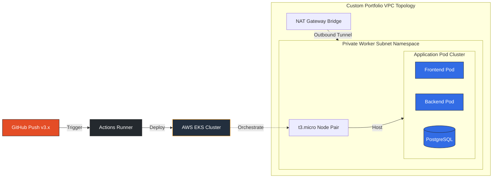

Cloud-Native GitOps Web Portfolio on Amazon EKS

A production-ready, full-stack multi-page web application architecture deployed on Amazon Elastic Kubernetes Service (EKS) using Terraform infrastructure-as-code and a fully automated GitOps CI/CD pipeline. 

This project demonstrates enterprise-grade container orchestration, infrastructure lifecycle management, secure credential tracking, and cloud cost-optimization strategies.

---
## 🏗️ Architecture Blueprint

## 🏗️ Architecture Blueprint

🔹 Infrastructure & Networking (Terraform)
- Custom VPC Topography: Spawns isolated public and private subnets across multiple Availability Zones to ensure high availability and application resilience.
- Secure Ingress Tunneling: Worker nodes are deployed completely within private subnets. Outbound communication for system updates is safely routed through an active NAT Gateway bridge.
- Remote State Vaulting: Utilizes an Amazon S3 backend for centralized `.tfstate` tracking, ensuring synchronization across all automation runs.

🔹 Container Orchestration (Kubernetes)
- EKS Control Plane v1.31: Running the stable, current-generation enterprise Kubernetes engine.
- EKS API Access Mapping: Configured with explicit native API authentication mode and structured access entries, granting fine-grained administrative visibility to trusted IAM identities.
- Unified Application Stack: Coordinates a lightweight multi-page web frontend, a programmatic Python backend, and a stateful PostgreSQL database storage layer.

---

🚀 Automated GitOps Pipeline Layout

The project implements a dual-stage GitHub Actions deployment pipeline designed to prevent configuration drifts and accidental cloud billing surcharges:

1. Continuous Integration (`ci-validation`): Triggered on every commit to the `main` branch. Executes `terraform validate` and `terraform plan` dry-runs to inspect blueprints for structural or syntax version mismatches without spinning up real hardware.
2. Continuous Deployment (`cd-deployment`): Triggered exclusively via semantic version tags (e.g., `v3.x`). Automatically deploys network routing layers, provisions compute engines, attaches IAM policies, and rolls containers onto the nodes.

---

💡 Engineering Highlights & Cost Optimizations

- AWS Free Tier Friendly Layout: Engineered specifically to live within standard training budgets. Utilizes low-footprint `t3.micro` nodes with strict capacity allocations (2 desired instances) to safely optimize compute hour limits.
- Resource Optimization Blueprint: Suppressed heavy non-essential background metrics daemons and cluster log exporters to protect node RAM bounds, completely mitigating memory starvation risks.
- Automated Clean Lifecycle: Fully integrated with a comprehensive teardown pipeline (`destroy.yml`) and explicit KMS encryption lifecycle handling to avoid lingering resource or idle public IP surcharges.

---

 🛠️ Technology Ecosystem

- Cloud Platform: Amazon Web Services (AWS) — EKS, VPC, S3, IAM, CloudWatch, KMS
- Infrastructure as Code: Terraform (v21.x AWS EKS Modules, Provider v6.x)
- Containerization: Docker & Linux Container Environments
- Orchestration: Kubernetes (K8s API Objects, Secrets, Services)
- CI/CD Automation: GitHub Actions (YAML Workflows, OpenID Connect)
